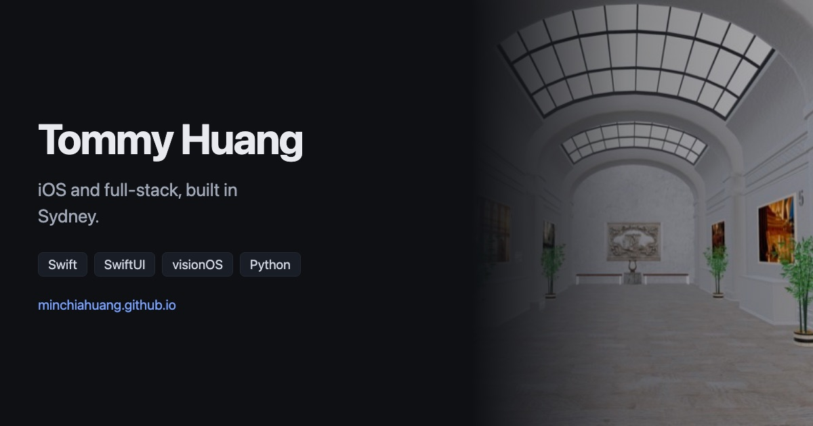

# Tommy Huang's portfolio

Personal portfolio for my iOS, full-stack and applied AI work. I am completing a Master of IT at UTS and looking for a software engineering internship or graduate role in Sydney.

[Visit the portfolio](https://minchiahuang.github.io/) · [Download my résumé](https://minchiahuang.github.io/TommyHuang_Resume.pdf) · [Connect on LinkedIn](https://www.linkedin.com/in/min-chia-huang-698a6b184/)



## Selected work

- [CookPilot](https://minchiahuang.github.io/cookpilot.html) is a hands-free iOS cooking assistant for Ray-Ban Meta glasses. It won first place at the ICON x Lyra Hackathon in July 2026.
- [Visual Eyes](https://minchiahuang.github.io/visual-eyes.html) is an in-development visionOS prototype that turns a person's answers about their future into a narrated, walkable museum.
- [LearnGuard](https://github.com/minchiaHuang/LearnGuard) is an MCP action gate that asks learners to demonstrate understanding before stronger workspace actions are allowed.
- [VaxAgent](https://github.com/minchiaHuang/VaxAgent) is an explainable veterinary oncology research workflow prototype.

## Run locally

The site is static and has no package dependencies.

```bash
python3 -m http.server 8000
```

Open `http://localhost:8000` in a browser.
